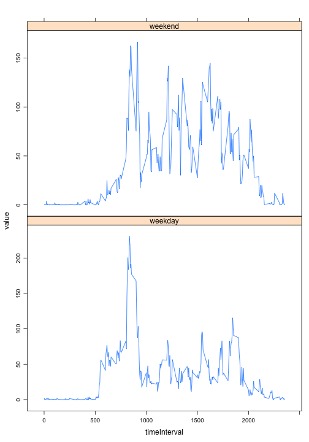

Assignment1: Personal Activity Monitoring
========================================================

This is an R Markdown document which completes the first Peer Assessment Exercise. First load the data into a data.frame.


```r
activityData <- read.csv("activity.csv")
```


Next, the rows with **NA** values for the number of steps or those with missing data are removed from the data.frame.


```r
activityDataTMP <- na.omit(activityData)
```


The total number of steps a day is computed and inserted into a new data.frame. The steps data are then plotted as a histogram.


```r
df <- data.frame(date = character(), total = numeric())
dates <- as.Date(unique(activityDataTMP$date))
for (i in 1:length(dates)) {
    df <- rbind(df, data.frame(date = dates[i], total = sum(activityDataTMP[as.Date(activityDataTMP$date) == 
        dates[i], ]$steps)))
}
hist(df$total, xlab = "Total number of Steps", main = "")
```

 


Calculate the mean and median of the number of steps completed each day.


```r
mean(df$total)
```

```
## [1] 10766
```

```r
median(df$total)
```

```
## [1] 10765
```


Create a time series plot of the 5 minute interval against the number of steps averaged across all the days. First create a dataframe containing the required data, i.e. the time interval and the average number of steps. Then plot a line graph of the data.


```r
newdf <- data.frame(intvl = numeric(), avg = numeric())
timestep <- unique(activityDataTMP$interval)
for (i in 1:length(timestep)) {
    newdf <- rbind(newdf, data.frame(intvl = timestep[i], avg = mean(activityDataTMP[activityDataTMP$interval == 
        timestep[i], ]$steps)))
}
plot(newdf$intvl, newdf$avg, type = "l", xlab = "Interval", ylab = "Average number of Steps", 
    main = "")
```

 


Which 5min interval contains the maximum number of steps?


```r
MaxInterval <- subset(newdf, newdf$avg == max(newdf$avg))[1]
as.numeric(MaxInterval)
```

```
## [1] 835
```


There are a number of **NA** values that will be contaminating the results. The total number of rows containing **NA** is:


```r
length(activityData$steps) - length(activityDataTMP$steps)
```

```
## [1] 2304
```


The missing values can be replaced with a given number. Here, I use the sample mean for the timestep that the data are taken from. To do this I copy the data.frame to a new data.frame, loop over the full dataset, find the rows with **NA** and then insert the relavant number from the data.frame containing the averages.


```r
activityDataNew <- activityData
for (i in 1:length(activityDataNew$steps)) {
    if (is.na(activityDataNew$steps[i])) {
        activityDataNew$steps[i] <- newdf$avg[newdf$intvl == activityDataNew$interval[i]]
    }
}
```


We plot the new total steps data are plotted as a histogram.


```r
df2 <- data.frame(date = character(), total = numeric())
dates <- unique(activityDataNew$date)
for (i in 1:length(dates)) {
    df2 <- rbind(df2, data.frame(date = dates[i], total = sum(activityDataNew[activityDataNew$date == 
        dates[i], ]$steps)))
}
hist(df2$total, xlab = "Total number of Steps", main = "")
```

 


Calculate the new mean and median of the number of steps completed each day.


```r
mean(df2$total)
```

```
## [1] 10766
```

```r
median(df2$total)
```

```
## [1] 10766
```


Replacing the **NA** values with the mean value from the relevant timestep made no difference to the mean or the histogram. The median value increased by 1 step, making it identical to the mean value. Therefore, inserting the means made no significant difference to the dataset.

Next, to see if there is a difference between the weekdays and the weekends, a new data.frame is created containing the column "dayType" which is True for a weekday and False for the weekend.


```r
activityDataNew$dayType <- weekdays(as.Date(activityDataNew$date)) == "Monday" | 
    weekdays(as.Date(activityDataNew$date)) == "Tuesday" | weekdays(as.Date(activityDataNew$date)) == 
    "Wednesday" | weekdays(as.Date(activityDataNew$date)) == "Thursday" | weekdays(as.Date(activityDataNew$date)) == 
    "Friday"
```


The data is then sorted into weekday and weekend data, the average number of steps are counted for each interval and then plotted.


```r
par(mfrow = c(2, 1))
newdf2 <- data.frame(timeInterval = numeric(), weekday = numeric(), weekend = numeric())
timestep <- unique(activityDataNew$interval)
for (i in 1:length(timestep)) {
    newdf2 <- rbind(newdf2, data.frame(timeInterval = timestep[i], weekday = mean(activityDataNew[activityDataNew$interval == 
        timestep[i] & activityDataNew$dayType, ]$steps), weekend = mean(activityDataNew[activityDataNew$interval == 
        timestep[i] & !activityDataNew$dayType, ]$steps)))
}
library("reshape2")
library("lattice")
dat.m <- melt(newdf2, measure.vars = c("weekday", "weekend"))
xyplot(value ~ timeInterval | variable, data = dat.m, panel = "panel.lines", 
    layout = c(1, 2), scales = list(y = list(relation = "free")))
```

 


